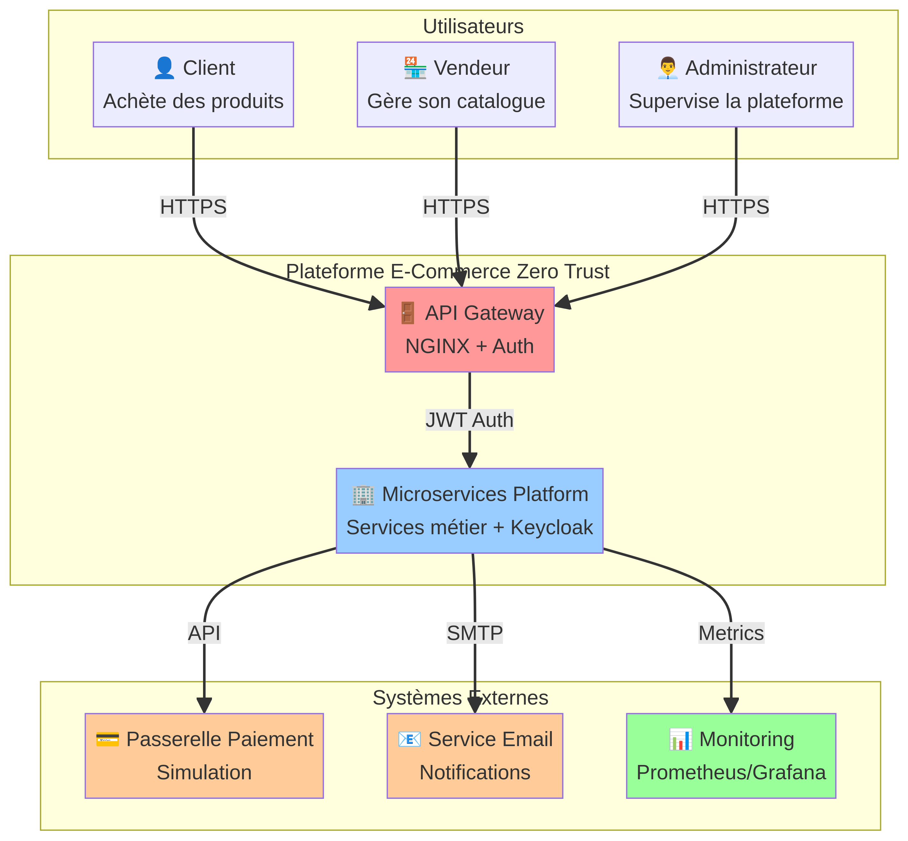
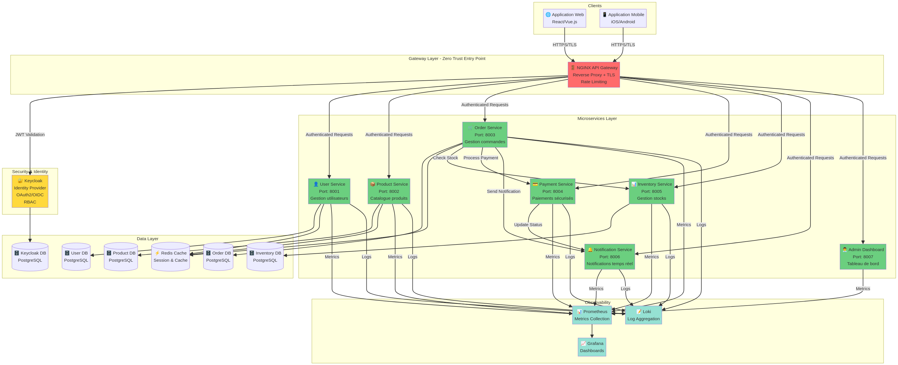
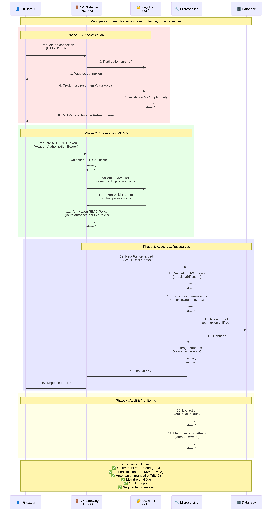
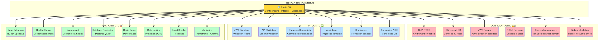

# Architecture Microservices Zero Trust - E-Commerce Platform

**Auteur(s) :** Quentin Chaillou - SPV M1 CS 2025  
**Date :** Novembre 2025  
**Module :** Architecture Microservices & Sécurité

---

## 1. Présentation du Projet

Ce projet consiste en la conception et l'implémentation d'une **plateforme e-commerce moderne et sécurisée**, basée sur une **architecture microservices**. L'objectif principal est de démontrer la maîtrise des concepts d'architecture distribuée tout en appliquant rigoureusement les principes de sécurité **Zero Trust** et de la **triade CIA (Confidentialité, Intégrité, Disponibilité)**.

La plateforme simule les fonctionnalités essentielles d'un site e-commerce, avec une authentification et une gestion des autorisations centralisées via **Keycloak**. L'ensemble de l'infrastructure est containerisé avec Docker et orchestré via Docker Compose pour un déploiement local simple et reproductible.

### Objectifs

- **Concevoir une architecture microservices pure**, où chaque service est indépendant, déployable et scalable.
- **Implémenter une sécurité Zero Trust**, en s'assurant que chaque requête est authentifiée et autorisée, quel que soit son origine.
- **Garantir la triade CIA** à travers des mécanismes de chiffrement, de contrôle d'accès, de validation de données et de haute disponibilité.
- **Mettre en place une observabilité complète** avec un logging et un monitoring centralisés.

### Périmètre Fonctionnel

La plateforme est composée des microservices suivants pour couvrir le périmètre fonctionnel attendu :

| Microservice | Port | Description |
|---|---|---|
| 👤 **User Service** | `8001` | Gestion des utilisateurs (clients, vendeurs, admins). |
| 📦 **Product Service** | `8002` | Gestion du catalogue de produits, avec recherche avancée. |
| 🛒 **Order Service** | `8003` | Workflow complet de gestion des commandes. |
| 💳 **Payment Service** | `8004` | Simulation de traitement des paiements sécurisés. |
| 📊 **Inventory Service** | `8005` | Gestion des stocks et de l'inventaire. |
| 🔔 **Notification Service** | `8006` | Envoi de notifications (email, etc.). |
| 👨‍💼 **Admin Dashboard** | `8007` | Service d'agrégation pour le tableau de bord administrateur. |

---

## 2. Architecture Générale

L'architecture est conçue en plusieurs couches logiques pour assurer la séparation des préoccupations, la sécurité et la scalabilité. Nous utilisons le **modèle C4** pour visualiser l'architecture à différents niveaux de détail.

### Diagramme de Contexte (Niveau 1)

Ce diagramme montre la vue d'ensemble du système et ses interactions avec les utilisateurs et les systèmes externes.



### Diagramme de Conteneurs (Niveau 2)

Ce diagramme zoome sur les conteneurs (microservices, bases de données, etc.) qui composent la plateforme e-commerce.



### Couches de l'architecture

1.  **Gateway Layer**: Un **API Gateway NGINX** sert de point d'entrée unique. Il gère le routage, la terminaison TLS, le load balancing, le rate limiting et une première couche de validation de sécurité.
2.  **Security & Identity**: **Keycloak** est utilisé comme Identity Provider (IdP) central. Il gère l'authentification (OAuth2/OIDC) et la définition des rôles (RBAC).
3.  **Microservices Layer**: Le cœur de l'application, où chaque service métier est implémenté en Python avec le framework **FastAPI** pour sa performance et sa simplicité.
4.  **Data Layer**: Chaque microservice possède sa propre base de données **PostgreSQL** pour garantir l'isolation (Database-per-Service pattern). **Redis** est utilisé pour le caching.
5.  **Observability Layer**: Une stack de monitoring complète avec **Prometheus** pour la collecte de métriques, **Grafana** pour la visualisation et les dashboards, et **Loki** pour l'agrégation des logs.

---

## 3. Explication des Méthodes & Outils pour le Zero Trust et la Triade CIA

### Sécurité Zero Trust

Le principe fondamental du Zero Trust est **"Ne jamais faire confiance, toujours vérifier"**. Chaque requête, même interne au réseau, doit être authentifiée et autorisée.



Voici comment ce principe est appliqué dans notre architecture :

- **Authentification Forte**: Toute interaction commence par une authentification forte via Keycloak. Les microservices ne communiquent jamais sans un **JSON Web Token (JWT)** valide.
- **Défense en Profondeur**: La validation du token est effectuée à deux niveaux : d'abord au niveau de l'API Gateway (NGINX), puis une seconde fois au sein de chaque microservice. Cela garantit que même si le gateway est compromis, la sécurité interne reste intacte.
- **Contrôle d'Accès Granulaire (RBAC)**: Keycloak définit des rôles (client, vendeur, admin) qui sont inclus dans le JWT. Chaque microservice utilise ces rôles pour autoriser ou refuser l'accès à ses endpoints de manière granulaire.
- **Segmentation Réseau**: Les conteneurs sont isolés dans des réseaux Docker distincts (`frontend`, `backend`, `database`). Le réseau `database` est `internal`, ce qui signifie qu'il n'est pas accessible depuis l'extérieur, ni même depuis le gateway, mais uniquement par les microservices du backend.
- **Chiffrement End-to-End**: La communication est chiffrée en transit via TLS/HTTPS depuis le client jusqu'à l'API Gateway.

### Triade CIA (Confidentialité, Intégrité, Disponibilité)

La sécurité de la plateforme est construite autour des trois piliers de la triade CIA.



| Pilier | Mécanismes d'implémentation |
|---|---|
| 🔒 **Confidentialité** | - **Chiffrement en transit (TLS/HTTPS)** au niveau du Gateway NGINX.<br>- **Contrôle d'accès (RBAC)** via Keycloak pour s'assurer que seuls les utilisateurs autorisés accèdent aux données.<br>- **Gestion des secrets** via des variables d'environnement Docker, évitant les secrets hardcodés.<br>- **Isolation réseau** pour protéger les bases de données. |
| ✅ **Intégrité** | - **Signature des JWT** pour garantir que les tokens n'ont pas été altérés.<br>- **Validation des données** à l'entrée de chaque API grâce à Pydantic dans FastAPI.<br>- **Contraintes transactionnelles et référentielles** dans les bases de données PostgreSQL.<br>- **Logs d'audit** pour tracer toutes les actions sensibles. |
| 🚀 **Disponibilité** | - **Load Balancing** implicite via les `upstream` de NGINX.<br>- **Health Checks** dans Docker Compose pour redémarrer automatiquement les services défaillants.<br>- **Politiques de redémarrage (`restart: unless-stopped`)** pour assurer la résilience des services.<br>- **Rate Limiting** sur NGINX pour se protéger contre les attaques par déni de service (DDoS).<br>- **Monitoring et alertes** avec Prometheus et Grafana pour détecter et réagir rapidement aux pannes. |

### Outils Utilisés

| Outil | Rôle dans le projet |
|---|---|
| **Docker / Docker Compose** | Containerisation de l'ensemble des services et orchestration locale. |
| **NGINX** | API Gateway, reverse proxy, load balancing, terminaison TLS, sécurité. |
| **Keycloak** | Fournisseur d'identité (IdP) pour l'authentification et l'autorisation (OAuth2/OIDC, RBAC). |
| **Python / FastAPI** | Framework de développement des microservices, choisi pour sa performance et sa robustesse. |
| **PostgreSQL** | Système de gestion de base de données relationnelle pour chaque microservice. |
| **Prometheus** | Collecte des métriques de performance et de santé des services. |
| **Grafana** | Visualisation des métriques et création de dashboards de monitoring. |
| **Loki** | Agrégation et consultation des logs de tous les services. |

---

## 4. Autres Considérations et Remarques

### Choix Technologiques

- **FastAPI (Python)**: Ce framework a été choisi pour sa syntaxe moderne (basée sur l'injection de dépendances), sa validation de données native avec Pydantic, sa génération automatique de documentation OpenAPI, et ses excellentes performances, ce qui en fait un candidat idéal pour les microservices.
- **NGINX**: Préféré à d'autres gateways comme Kong ou Traefik pour sa légèreté, sa flexibilité et sa large adoption dans l'industrie. Sa configuration, bien que manuelle, offre un contrôle très fin sur le routage et la sécurité.
- **PostgreSQL**: Une base de données relationnelle robuste et éprouvée, parfaitement adaptée aux besoins transactionnels d'une plateforme e-commerce.

### Défis Rencontrés et Solutions

- **Configuration de Keycloak**: L'intégration de Keycloak peut être complexe. La solution a été de créer un fichier de configuration de realm (`realm-config.json`) qui peut être importé pour automatiser la création des rôles, clients et utilisateurs, rendant le setup reproductible.
- **Sécurité Inter-Services**: Assurer que les appels entre microservices sont sécurisés est un défi majeur. La solution adoptée est de propager le JWT token initial de l'utilisateur lors des appels internes, permettant à chaque service de valider l'identité et les permissions de l'appelant originel.

### Améliorations Possibles

- **Service Mesh**: Pour une gestion plus avancée de la sécurité et de l'observabilité inter-services, l'intégration d'un service mesh comme **Istio** ou **Linkerd** serait une étape logique. Cela permettrait d'implémenter le mTLS (mutual TLS) de manière transparente.
- **CI/CD Pipeline**: Mettre en place une pipeline d'intégration et de déploiement continus (avec GitHub Actions, GitLab CI) pour automatiser les tests, la construction des images Docker et le déploiement.
- **Bases de Données Réelles**: Remplacer les bases de données en mémoire utilisées pour la simulation dans certains services par de vraies instances PostgreSQL pour une persistance complète.
- **Tests Avancés**: Développer des scénarios de tests plus complets, incluant des tests d'intégration, des tests de charge et des tests de pénétration pour valider la robustesse et la sécurité de l'architecture.

---

## Guide de Démarrage

Pour des instructions détaillées sur l'installation, la configuration et le test de la plateforme, veuillez consulter le guide de démarrage rapide :

➡️ **[QUICKSTART.md](QUICKSTART.md)**

### Commande de base

```bash
# Naviguer dans le dossier de l'infrastructure
cd infrastructure

# Démarrer tous les services en arrière-plan
docker-compose up -d
```
